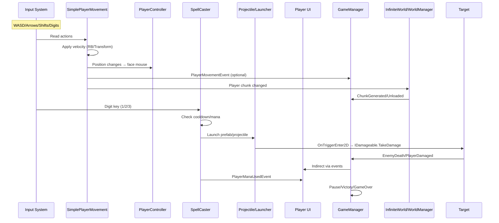
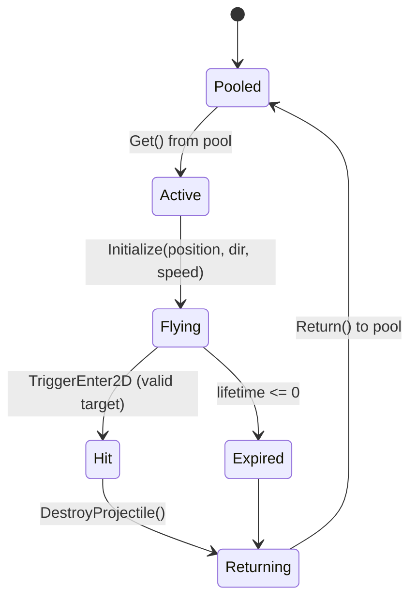

# RougeLite101 Diagrams

This page collects high-level diagrams (Mermaid) of core systems and flows. View on a Markdown renderer that supports Mermaid (e.g., GitHub).

## Event System Overview

```mermaid
graph TD
  subgraph Gameplay & UI
    A[Producer\\n(e.g., PlayerStats, SpellCaster, Projectile)] -->|Broadcast<T>| EM
    L1[Listener\\n(e.g., PlayerUI, GameManager)]
    L2[Listener\\n(e.g., Debug Console, Audio)]
  end
  subgraph Core
    EM[EventManager\\n(Type->Listeners, Queue)]
  end
  EM -->|Dispatch<T>| L1
  EM -->|Dispatch<T>| L2
  EB[EventBehaviour\\nhelpers] -.-> A
  EB -.-> L1
```

## Runtime Gameplay Flow



## Manager Relationships

```mermaid
graph LR
  IM[InputManager] --- GM[GameManager]
  UIM[UIManager] --- GM
  AM[AudioManager] --- GM
  SM[SaveManager] --- GM
  STM[SceneTransitionManager] --- GM
  GM -->|Broadcast| EM[EventManager]
  UIM -->|Subscribe| EM
  Note right of GM: Singleton, state machine
  Note left of IM: New + Legacy input
```

## Projectile Lifecycle



## Infinite World Chunks

```mermaid
flowchart TB
  P[Player] -->|GetChunkPosition| C[Current Chunk]
  C --> G[Generate Around Player\\n(-N..+N in grid)]
  C --> U[Unload Distant]
  G --> CE[ChunkGeneratedEvent]
  U --> CU[ChunkUnloadedEvent]
  subgraph Biome
    B1[BiomeDataSO/Struct]
    B1 -->|rates, prefabs| G
  end
```

---

For detailed narrative explanations, see:
- Architecture: ARCHITECTURE.md
- Runtime Flow: RUNTIME_FLOW.md
- Code Map: CODEMAP.md
