# Software Requirements Specification (SRS)

## RougeLite101

-   Document Date: 2025-11-26
-   Version: 1.0

---

## List of Participating Students

-   Student A (Team Lead) — Gameplay Systems, Architecture
-   Student B — AI & Enemy Behaviour
-   Student C — UI/UX & HUD
-   Student D — Level/Dungeon Generation
-   Student E — Audio & VFX

Note: Replace placeholder names/roles with the actual team roster.

## Acknowledgements

-   University/Department staff and course instructors for guidance.
-   Open-source communities and Unity forums for shared knowledge.
-   Asset creators for any third-party art/audio per attributions.

## Executive Summary

RougeLite101 is a top-down roguelite dungeon crawler focused on fast combat, tactical spell casting, and room-based traversal. This SRS defines goals, scope, system context, detailed requirements, and models (use cases, class/sequence/state/activity diagrams) to enable consistent design and development. It also specifies UI structure, constraints, and quality attributes to guide implementation and testing.

## Table of Contents

-   [Chapter 1 – Introduction](#chapter-1--introduction)
    -   [1.1 Objectives](#11-objectives)
    -   [1.2 Scope](#12-scope)
    -   [1.3 Methodology](#13-methodology)
    -   [1.4 Definitions, Abbreviations, and Acronyms](#14-definitions-abbreviations-and-acronyms)
    -   [1.5 Structure of the Report](#15-structure-of-the-report)
-   [Chapter 2 – Overall Description](#chapter-2--overall-description)
    -   [2.1 Product Background](#21-product-background)
    -   [2.2 User Characteristics](#22-user-characteristics)
    -   [2.3 System Context and Environment](#23-system-context-and-environment)
    -   [2.4 Architectural Overview](#24-architectural-overview)
    -   [2.5 Constraints](#25-constraints)
    -   [2.6 Assumptions and Dependencies](#26-assumptions-and-dependencies)
    -   [2.7 Requirement Allocation to Components](#27-requirement-allocation-to-components)
-   [Chapter 3 – Specific Requirements](#chapter-3--specific-requirements)
    -   [3.1 Functional Requirements Overview](#31-functional-requirements-overview)
    -   [3.2 Non-Functional Requirements Overview](#32-non-functional-requirements-overview)
-   [Chapter 4 – Modeling Requirements](#chapter-4--modeling-requirements)
    -   [4.1 Use Case Model](#41-use-case-model)
    -   [4.2 Class Diagram](#42-class-diagram)
    -   [4.3 Sequence Diagrams](#43-sequence-diagrams)
    -   [4.4 State Diagrams](#44-state-diagrams)
    -   [4.5 Activity Diagrams](#45-activity-diagrams)
    -   [4.6 Component Interaction Diagram](#46-component-interaction-diagram)
    -   [4.7 Deployment Diagram](#47-deployment-diagram)
-   [Chapter 5 – User Interface Design](#chapter-5--user-interface-design)
-   [Chapter 6 – References](#chapter-6--references)
-   [Chapter 7 – Terms and Policies](#chapter-7--terms-and-policies)

---

## Chapter 1 – Introduction

### 1.1 Objectives

-   Define clear, testable functional and non-functional requirements.
-   Provide architectural and behavioral models to align implementation.
-   Establish common terminology and assumptions for the team.
-   Support verification, validation, and future extensions.

### 1.2 Scope

-   A single-player, room-based roguelite with procedural dungeon progression.
-   Core loop: explore rooms → combat enemies → collect loot/spells → find exit → progress to next floor → repeat → final outcome (win/lose).
-   Systems: Player controller, camera follow, spell casting and cooldowns, enemy AI (patrol/chase/attack), health/damage/knockback, loot, room transitions, dungeon management, UI (HUD, menus), audio/VFX.

### 1.3 Methodology

-   Iterative, feature-driven development with short milestones.
-   Version control and PR-based code reviews.
-   Requirement traceability from FR/NFR to components and tests.
-   Playtesting-driven refinement with defect tracking.

### 1.4 Definitions, Abbreviations, and Acronyms

-   RNG: Random Number Generation.
-   UI/HUD: User Interface / Heads-Up Display.
-   URP: Universal Render Pipeline.
-   HP: Health Points.
-   DPS: Damage per Second.
-   FR/NFR: Functional Requirement / Non-Functional Requirement.
-   Room: A bounded combat/play space connected to others via doors.
-   Floor: A collection of rooms culminating in an exit to the next level.

### 1.5 Structure of the Report

This report proceeds from goals and context (Ch.1–2), through detailed requirements (Ch.3), models (Ch.4), UI design (Ch.5), references (Ch.6), and project terms (Ch.7).

---

## Chapter 2 – Overall Description

### 2.1 Product Background

RougeLite101 is designed as a learning-first roguelite that balances tight controls, readable telegraphs, and replayability. Primary differentiators are responsive movement/spell casting and clear room transitions that maintain combat flow.

### 2.2 User Characteristics

-   Players: Casual to core action players; familiarity with keyboard/mouse or controller.
-   Accessibility: Color-blind safe palettes, configurable input, readable fonts.

### 2.3 System Context and Environment

Target environment: Desktop PC (Windows). The game uses Unity with URP and the Input System. It reads inputs, renders frames, plays audio, and optionally persists settings/save data.

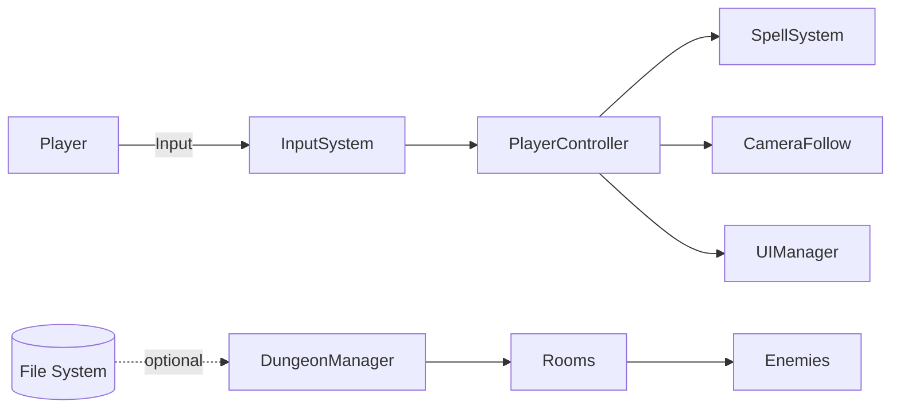

### 2.4 Architectural Overview

-   Scene-centric architecture with component-based entities.
-   Core managers: `DungeonManager`, `UIManager`, `AudioManager` (if present), `Spawn/RoomManager`.
-   Gameplay components: `PlayerController`, `SpellSystem`, `EnemyAI`, `Health/Damageable`, `Knockback`, `ExitDoor`, `CameraFollow`.
-   Data: ScriptableObjects for spells, enemies, and balance parameters.

### 2.5 Constraints

-   Performance target: 60 FPS on mid-range hardware for 1080p.
-   Input: Keyboard/mouse; optional controller mapping.
-   Visuals: URP-compatible shaders; low overdraw and particle budget.
-   Build size and memory budgets suitable for classroom/lab PCs.

### 2.6 Assumptions and Dependencies

-   Uses Unity engine (version per `Packages/manifest.json`).
-   Packages: Unity Input System, TextMeshPro, URP; additional assets as permitted.
-   No networked features in initial scope.

### 2.7 Requirement Allocation to Components

| Requirement              | Component(s)                                 |
| ------------------------ | -------------------------------------------- |
| FR-P-01 Movement         | PlayerController, Input System, CameraFollow |
| FR-P-02 Dash             | PlayerController, Stamina/Cooldown           |
| FR-P-03 Spell Cast       | PlayerController, SpellSystem, VFX/Audio     |
| FR-P-04 Damage/Knockback | Damageable, Health, Knockback, EnemyAI       |
| FR-E-01 Patrol/Chase     | EnemyAI, Nav/Pathing                         |
| FR-E-02 Attack           | EnemyAI, Damageable, Health                  |
| FR-UI-01 HUD             | UIManager, TMP, EventSystem                  |
| FR-UI-02 Menus           | UIManager, Scene/Canvas                      |
| FR-D-01 Room Transition  | DungeonManager, ExitDoor, CameraFollow       |

---

## Chapter 3 – Specific Requirements

### 3.1 Functional Requirements Overview

Player Behaviour Requirements

-   FR-P-01 Movement: The player SHALL move in 2D using WASD/left stick with configurable speed and acceleration.
-   FR-P-02 Dash: The player SHALL dash with i-frames for a short duration on cooldown.
-   FR-P-03 Spell Casting: The player SHALL cast a bound spell with aim toward cursor/right stick; spells apply damage/effects.
-   FR-P-04 Health: The player SHALL have HP; reaching 0 HP triggers death and game over state.
-   FR-P-05 Knockback: On receiving certain damage, the player SHALL be pushed away based on impulse.
-   FR-P-06 Interact/Exit: The player SHALL activate the exit door when room is cleared.

Enemy Behaviour Requirements

-   FR-E-01 Perception: Enemies SHALL perceive the player within a radius/line-of-sight.
-   FR-E-02 Patrol/Idle: Enemies SHALL idle or patrol when player unseen.
-   FR-E-03 Chase: Enemies SHALL chase the player when detected.
-   FR-E-04 Attack: Enemies SHALL perform melee or ranged attacks with telegraphed wind-up.
-   FR-E-05 Damage/Death: Enemies SHALL take damage, apply knockback, and die with loot/VFX hooks.

User Interface Requirements

-   FR-UI-01 HUD: The HUD SHALL display HP, stamina/mana, spell cooldowns, and pickups.
-   FR-UI-02 Main Menu: The game SHALL provide Start, Options, Exit.
-   FR-UI-3 Pause Menu: The game SHALL pause/resume with options for audio/input and a Quit to Menu.
-   FR-UI-04 Notifications: The UI SHALL communicate room clear, pickups, and errors unobtrusively.

Dungeon/Room Requirements

-   FR-D-01 Generation: The system SHOULD generate rooms/floors from templates/algorithms.
-   FR-D-02 Transitions: Entering an exit door SHALL transition to the next room/floor.
-   FR-D-03 Room Gates: Doors SHALL lock during combat and unlock when all enemies defeated.

Systems & Audio/VFX Requirements

-   FR-S-01 Save Settings: The game SHOULD persist user settings (volume, input binds).
-   FR-S-02 VFX/Audio Hooks: Spells, hits, deaths SHALL trigger VFX and SFX events.

Acceptance Criteria Examples

-   AC-P-03-A: Casting a spell reduces its cooldown and spawns the correct projectile within 1 frame of input.
-   AC-E-04-A: Enemy melee attack plays telegraph ≥ 0.2s before hit and respects i-frames.
-   AC-UI-01-A: HUD updates HP within 0.1s of damage event.

### 3.2 Non-Functional Requirements Overview

-   NFR-Perf-01: Maintain 60 FPS on target hardware in standard encounters (≤ 10 active enemies, ≤ 50 projectiles).
-   NFR-Usab-01: Default keyboard/mouse bindings with remapping support for primary actions.
-   NFR-Acc-01: Provide color-blind friendly palettes and font sizes ≥ 14px equivalent.
-   NFR-Reliab-01: No hard crashes during a 30-minute play session; handled exceptions logged.
-   NFR-Maint-01: Components SHALL follow SOLID where practical; public APIs documented.
-   NFR-Test-01: Critical systems (PlayerController, EnemyAI, SpellSystem) SHALL have playtest checklists; unit tests where feasible.
-   NFR-Compat-01: URP-compatible shaders and post-processing; no platform-specific code without guards.

---

## Chapter 4 – Modeling Requirements

### 4.1 Use Case Model

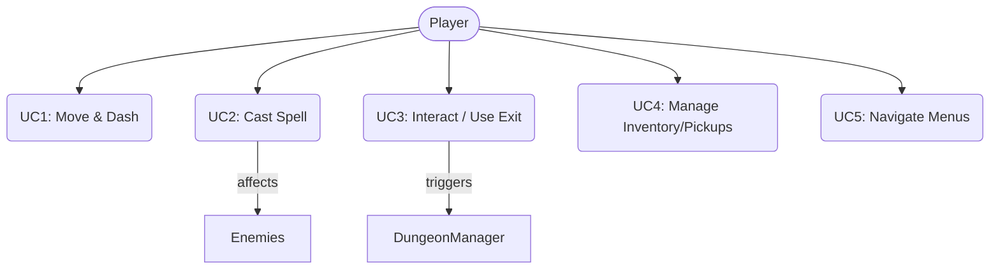

Primary Use Cases

-   UC1: Move & Dash — Player navigates spaces and evades danger.
-   UC2: Cast Spell — Player executes offensive/utility spells.
-   UC3: Interact / Use Exit — Player unlocks/uses doors to transition rooms.
-   UC4: Manage Inventory/Pickups — Player collects and benefits from loot.
-   UC5: Navigate Menus — Player starts game, pauses, adjusts options.

### 4.2 Class Diagram

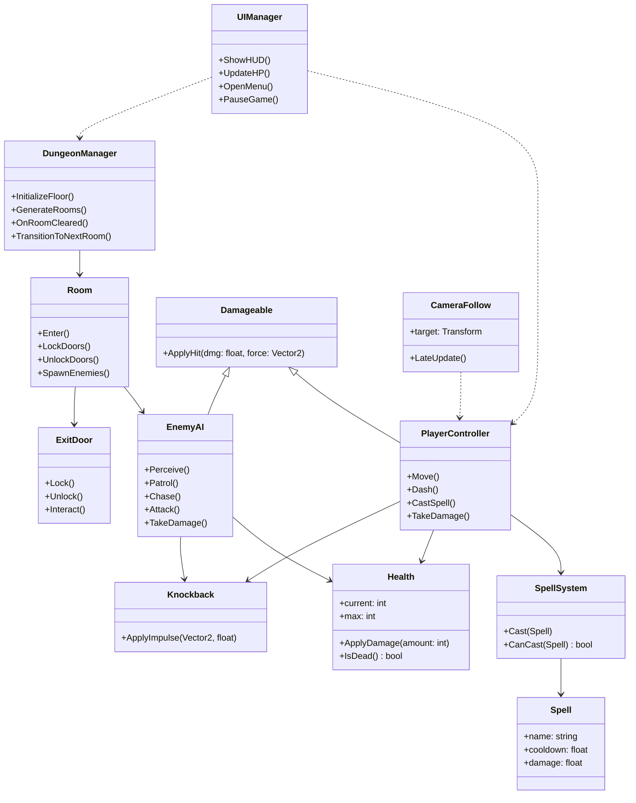

### 4.3 Sequence Diagrams

Room Transition

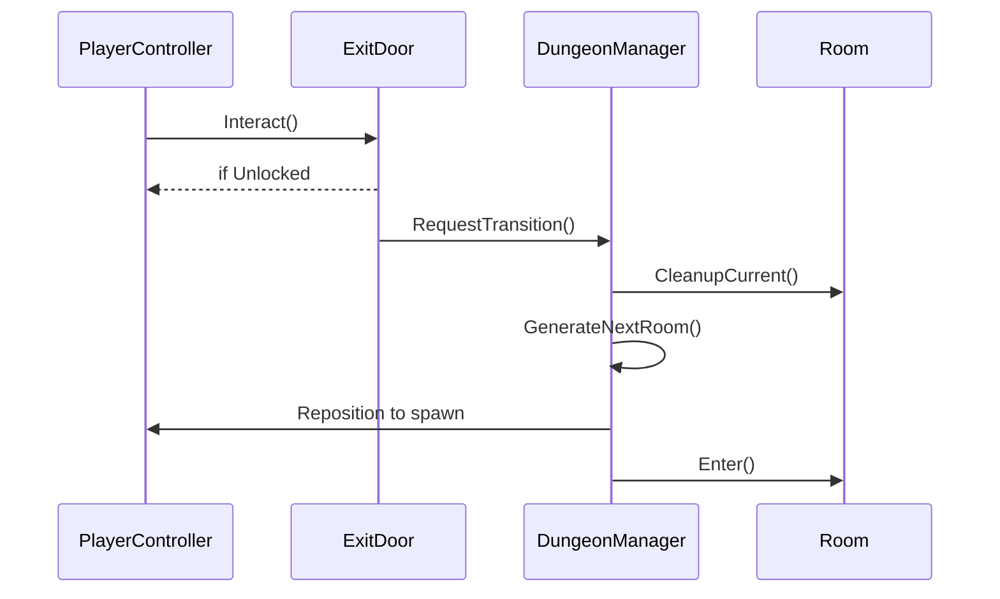

Spell Casting

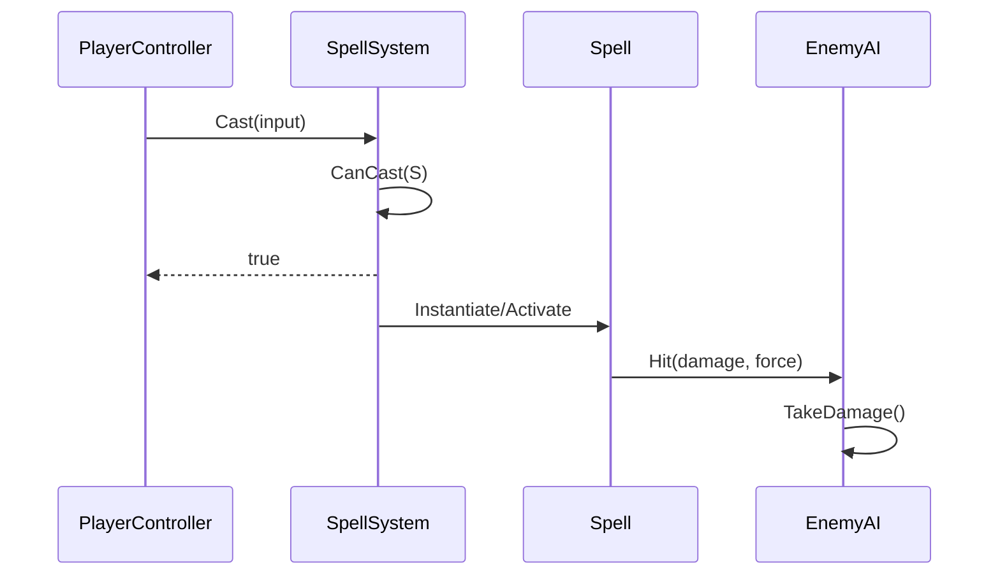

Player Damage & Knockback

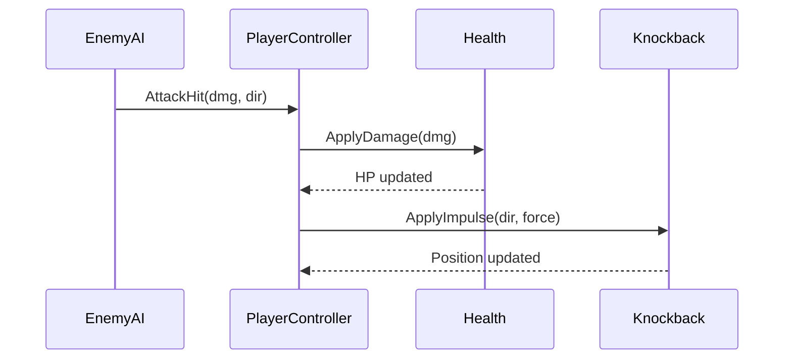

Enemy AI Behaviour

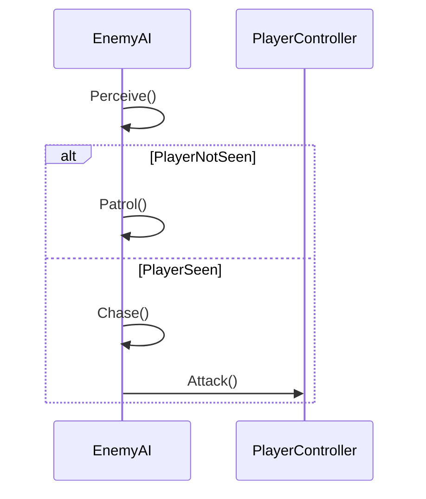

### 4.4 State Diagrams

Player State Machine

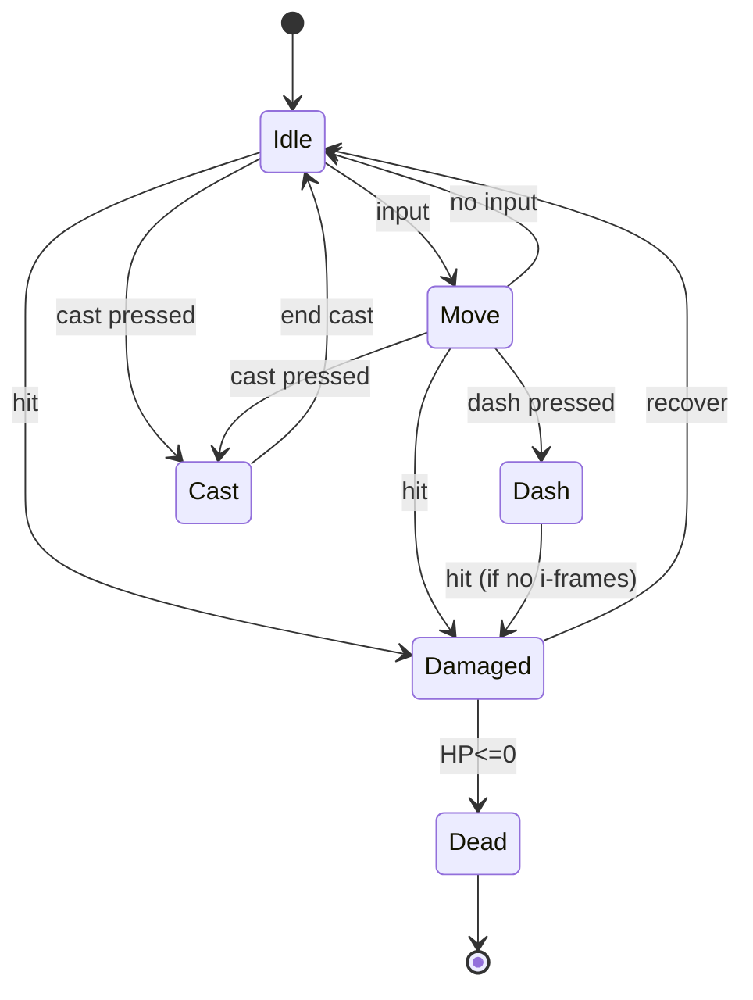

Enemy AI State Machine

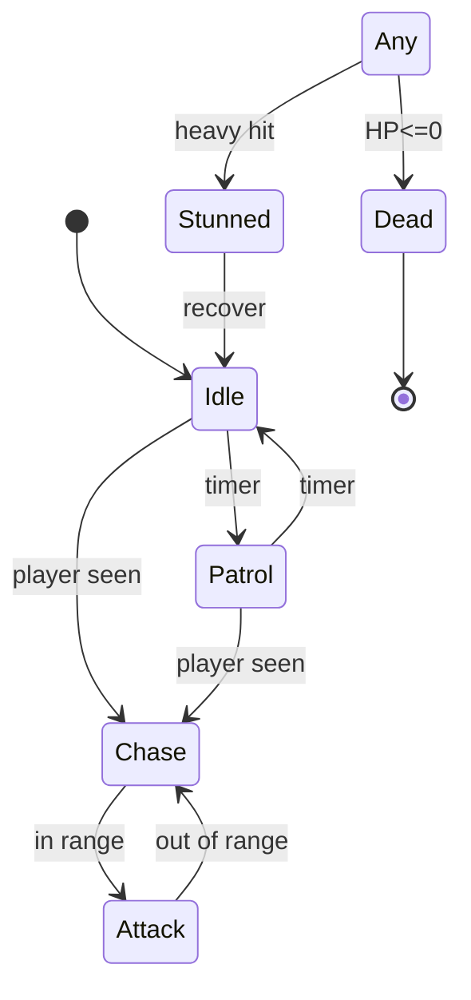

Exit Door State Machine

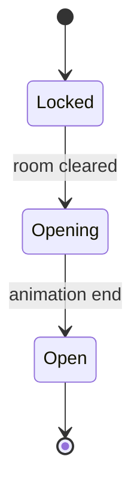

Dungeon Manager State Machine

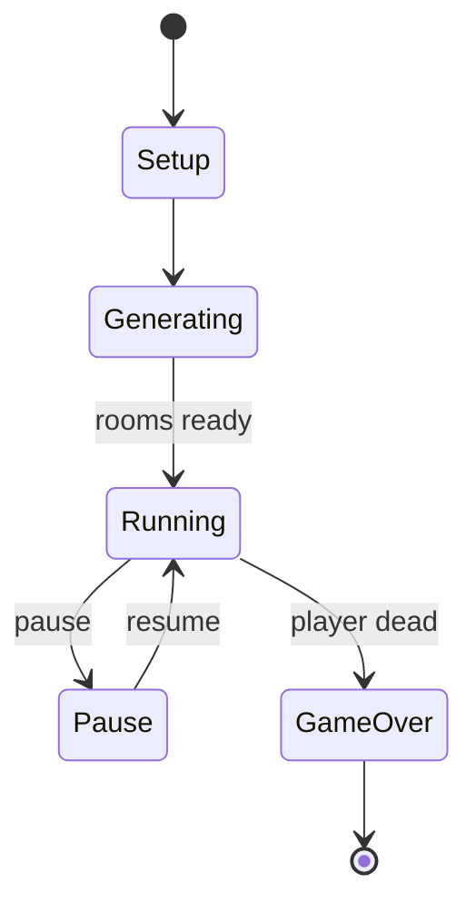

### 4.5 Activity Diagrams

Complete Game Flow

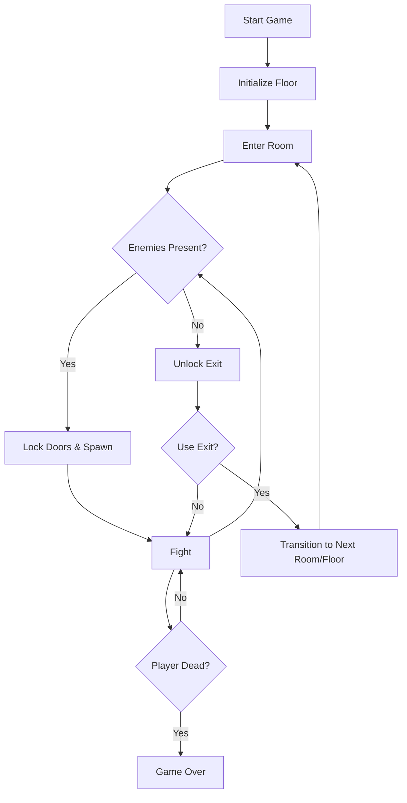

Spell Casting

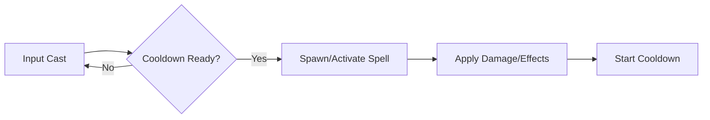

### 4.6 Component Interaction Diagram

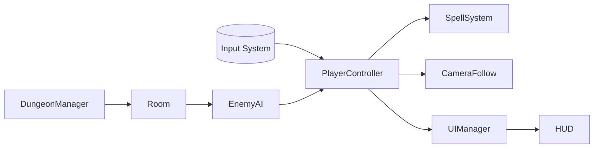

### 4.7 Deployment Diagram

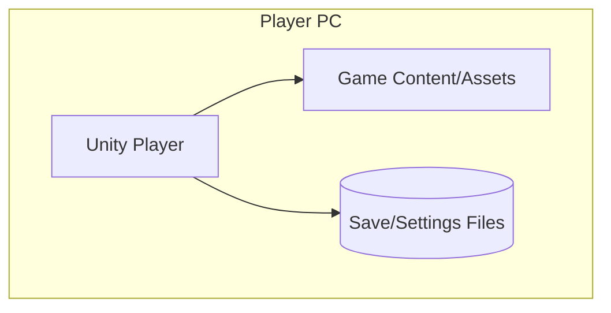

---

## Chapter 5 – User Interface Design

### 5.1 Main Menu

-   Elements: Title, Start, Options, Exit.
-   Behaviour: Keyboard/controller navigation; confirmation prompts on Exit.
-   Options: Audio volumes, input bindings, display settings (if applicable).

### 5.2 HUD & Gameplay UI

-   HUD: HP bar/hearts, stamina/mana, spell icons with cooldown timers, pickup notifications.
-   Feedback: Damage flashes, low-HP warning, room clear banner.
-   Clarity: High-contrast, minimal clutter; scale with screen resolution.

### 5.3 Pause Menu

-   Elements: Resume, Options, Quit to Main Menu.
-   Behaviour: Timescale pause for gameplay; UI remains responsive.
-   Accessibility: Persistent volume sliders and binding menus.

---

## Chapter 6 – References

-   Unity Manual & Scripting API (Input System, URP, ScriptableObjects, Coroutines).
-   TextMesh Pro User Guide.
-   Game AI patterns for 2D action games (state machines, perception, telegraphing).
-   Project’s `README.md` and `LICENSE` files in the repository.

---

## Chapter 7 – Terms and Policies

-   Licensing: See repository `LICENSE` for code and content licensing terms.
-   Third-Party Assets: Respect individual asset licenses and attribution requirements.
-   Privacy: No personal data collection; local settings/save only.
-   Academic Integrity: All code, documents, and assets adhere to course policies.
-   Accessibility Commitment: Reasonable efforts for readability and control remapping.

---

End of SRS.
