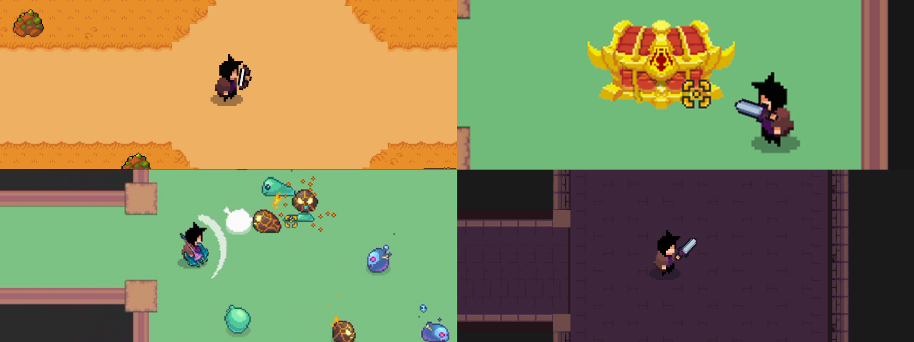

# RougeLite101

**RougeLite101** is a Unity 2D top-down roguelite game prototype developed for the graduation thesis project:

**Top-Down Roguelite Game Featuring AI-Driven Adaptive Difficulty Scaling**

The project demonstrates a playable roguelite gameplay loop with procedural dungeon progression, real-time combat, enemy encounters, inventory and equipment foundations, save-related systems, run-result flow, and an early adaptive-difficulty telemetry foundation.

This repository should be understood as an academic game prototype rather than a finished commercial product. Some systems are implemented for research, demonstration, and evaluation purposes, while several areas remain under development or require further polish.

---

## Latest Release

The latest thesis prototype release is available here:

[RL28 – Latest Capstone Prototype Build](https://github.com/Bright-04/RougeLite101/releases/latest)

This release represents the latest stabilized prototype build prepared for thesis demonstration, documentation, and evaluation.

---

## Thesis Information

* **Thesis Title:** Top-Down Roguelite Game Featuring AI-Driven Adaptive Difficulty Scaling
* **Project Name:** RougeLite101
* **Project Type:** Graduation thesis / capstone prototype
* **Development Platform:** Unity 2D
* **Engine Version:** Unity `6000.3.13f1`
* **Main Research Direction:** Adaptive difficulty in roguelite gameplay using runtime player-performance telemetry
* **Current Status:** Playable prototype
* **Instructor:** Prof. Hoàng Văn Dũng

The thesis focuses on designing and implementing a top-down roguelite prototype with procedural dungeon generation, combat encounters, player progression, and a foundation for dynamic difficulty adjustment. The implemented Director-related systems currently support telemetry collection and performance-oriented evaluation, but the complete feedback loop where enemy behavior or encounter generation fully reacts to player-performance metrics remains a future improvement.

---

## Project Status

RougeLite101 is currently a **playable academic prototype**.

The current development priority is to stabilize existing gameplay systems, document the implemented architecture, prepare the prototype for thesis demonstration, and clarify the boundary between completed systems and future improvements.

The adaptive difficulty direction remains a core research goal of the thesis. However, the current implementation should be described as an adaptive-difficulty foundation rather than a complete production-ready AI Director system.

---

## Main Features

* 2D top-down player movement
* Dash-based movement support
* Melee and projectile weapon combat
* Spell casting with multiple spell slots
* Enemy and boss encounters
* Procedural dungeon generation using authored room templates
* Themed dungeon room sets
* Room-based combat progression
* Inventory and item pickup systems
* Equipment, armor, and weapon loadout systems
* Save and auto-save related systems
* Run-result and progression-related systems
* Combat telemetry and intensity tracking through the Director foundation
* Early adaptive-difficulty research infrastructure

---

## Technical Scope

The prototype is organized around several major gameplay and runtime systems:

### Core Systems

The core layer manages lifecycle behavior, player input, camera behavior, scene transitions, and common runtime infrastructure.

### Player System

The player system contains player movement, dash behavior, player stats, interaction handling, and direct player-state behavior.

### Combat, Weapons, and Equipment

The combat-related systems handle damage, attacks, projectiles, spells, weapon switching, weapon data, equipment loadouts, and combat feedback.

### Dungeon System

The dungeon system manages procedural room progression, room templates, room themes, spawn profiles, exit flow, and boss-related hooks.

### Enemy System

The enemy system contains enemy health, damage handling, movement, AI behavior, attack behavior, and boss/enemy-specific implementations.

### Inventory and Progression

The inventory and progression systems support item pickup, inventory UI, equipment-related data, experience progression, and player-growth foundations.

### Run Result System

The run-result flow handles the end-of-run state, result presentation, star rating, and transition back to the main game flow.

### Director and Adaptive Difficulty Foundation

The Director-related systems currently support combat telemetry and intensity tracking. This provides the foundation for adaptive difficulty research, but the full closed-loop behavior adjustment system is still incomplete.

### Save System

The save system supports selected persistence flows for player state, progression-related data, shop-related data, and runtime save integration.

---

## Architecture Overview

The project follows a domain-oriented organization model. New work should follow this ownership structure when possible:

* `Core` — lifecycle, input, camera, and scene-flow infrastructure
* `Player` — player entity behavior and player state
* `Combat` — shared damage, projectiles, spells, and combat utilities
* `Weapons` — weapon runtime behavior, weapon data, alignment, and weapon pickups
* `Equipment` — armor and equipment loadout logic
* `Inventory` — inventory data, item data, inventory UI, and generic pickups
* `Enemies` — enemy AI, movement, health, damage handling, and shared enemy helpers
* `Dungeon` — procedural generation, room structure, themes, spawn profiles, exit flow, and boss hooks
* `Run` — run result flow, rules, and session state
* `Director` — combat telemetry, intensity tracking, and adaptive-difficulty foundation
* `Progression` — experience and progression-related data
* `Save` — save/load runtime flow and save data transfer objects
* `UI` — presentation-facing UI behavior

Legacy folders and older structure remnants may still exist in the repository. The domain-based layout above should be treated as the current reference model for new implementation and documentation work.

---

## Scene Overview

The main build flow currently uses the following scenes:

* `MainMenu` — entry menu scene
* `GameHome` — hub or home scene used by the current scene flow
* `Dungeon` — active gameplay scene for procedural dungeon runs
* `RunResultScene` — result scene used after run completion

Additional non-core or testing scenes may exist in the repository, such as weapon-alignment or older map-testing scenes. These should not be treated as part of the main player-facing flow unless explicitly documented.

---

## Requirements

To open and run the project, use:

* Unity `6000.3.13f1`
* Universal Render Pipeline, or URP
* Unity Input System package

---

## How to Run

1. Clone or download the repository.
2. Open the project using Unity `6000.3.13f1`.
3. Open one of the main scenes:

   * `Assets/Scenes/MainMenu.unity`
   * `Assets/Scenes/GameHome.unity`
4. Press **Play** in the Unity Editor.
5. Start or enter the dungeon flow from the available menu or hub scene.

---

## Controls

Verified keyboard and mouse controls from the current input actions asset:

| Input               | Action                  |
| ------------------- | ----------------------- |
| `W`, `A`, `S`, `D`  | Move                    |
| `Space`             | Dash                    |
| `Left Mouse Button` | Attack                  |
| `1`, `2`, `3`       | Cast spells             |
| `E`                 | Interact                |
| `Q`                 | Swap weapon             |
| `Esc`               | Open pause menu         |
| `Tab`               | Open or close stats     |
| `I`                 | Open or close inventory |

Some gamepad bindings may exist in the input actions asset, but they are not fully documented in this README.

---

## Documentation

Additional documentation is available in the `Documentation` folder:

* [Documentation Overview](./Documentation/README.md)
* [Current Project Organization](./Documentation/System%20Architecture/Current_Project_Organization.md)
* [System Overview](./Documentation/System%20Architecture/System_Overview.md)
* [Manual Tilemap Room Guide](./Documentation/Level%20Design/Manual_Tilemap_Room_Guide.md)

---

## Known Issues and Work in Progress

* The AI Director currently provides telemetry and intensity tracking, but the full adaptive feedback loop is not complete.
* Enemy behavior does not yet fully react to collected player-performance metrics.
* Architecture cleanup and responsibility alignment are still ongoing.
* Some legacy folders, scripts, and older documentation references still exist.
* Dungeon, inventory, save, and run-result flows may still require stabilization.
* Some UI, balancing, animation, and content polish remain prototype-level.
* Gamepad support is not fully documented.
* The project is prepared for academic evaluation rather than commercial release.

---

## Roadmap

Planned or recommended future work includes:

* Complete the adaptive difficulty feedback loop
* Connect Director scoring to enemy, spawn, or encounter adjustment
* Improve enemy behavior variation under different difficulty profiles
* Continue architecture cleanup and responsibility alignment
* Reduce redundant systems and legacy folder overlap
* Stabilize save, inventory, and run-result integration
* Expand dungeon room variety and combat content
* Improve UI feedback, balancing, and visual polish
* Add more thesis-oriented diagrams, screenshots, and evaluation evidence

---

## Academic Note

This repository is maintained primarily as part of a graduation thesis prototype. The goal is to demonstrate practical system design, Unity implementation, procedural dungeon flow, combat gameplay, telemetry collection, and the foundation of adaptive difficulty in a top-down roguelite game.

The project is not intended to represent a fully polished commercial game release.

---

## License

This project is licensed under the [MIT License](./LICENSE).
