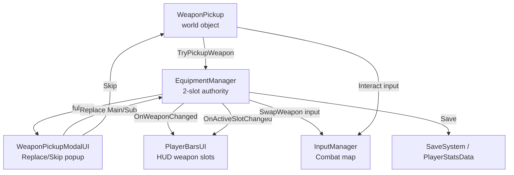

# Weapon Pickup + Swap System

Triển khai hoàn chỉnh hệ thống nhặt vũ khí bằng Interact, quản lý 2 slot Main/Sub, popup Replace/Skip khi đầy slot, cập nhật HUD, và lưu trạng thái weapon trong run.

## Hiện trạng Codebase

Sau khi nghiên cứu toàn bộ code hiện tại, đây là tổng hợp:

| Component | Hiện trạng | Vấn đề |
|---|---|---|
| `EquipmentManager` | Chỉ hỗ trợ **1 slot** (`equippedWeapon`), nhận `GameObject` prefab | Cần nâng lên 2-slot, chuyển sang dùng `WeaponDefinitionSO` |
| `Weapon` (abstract) | Rất minimal: `cooldown`, `nextUseTime`, `Use()` | OK, giữ nguyên |
| `ActiveWeapon` | Stub TODO, chỉ có `currentWeapon` get/set | **Sẽ bị bỏ** — gộp chức năng vào EquipmentManager |
| `Sword` / `Bow` | Kế thừa `Weapon`, logic attack OK | Không cần sửa logic, chỉ cần đảm bảo prefab có `Weapon` component |
| Input Actions | 4 maps: Movement, Combat, NavigateUI, UI. **Chưa có Interact** | Cần thêm Interact action vào Combat map |
| `InputManager` | Singleton, `EnableUIMap()` / `DisableUIMap()` pattern chuẩn | Cần thêm enable/disable cho Interact action |
| `PlayerBarsUI` | HP + Mana bars, poll mỗi frame | Cần thêm weapon slot icons (event-driven) |
| `SaveSystem` | BinaryFormatter, lưu `PlayerStatsData` | Cần thêm weapon fields vào `PlayerStatsData` |
| `PauseMenu` / `StatsMenu` | Dùng `EnableUIMap`/`DisableUIMap` pattern | Tham khảo pattern cho modal popup |
| SO pattern | Đã có `Spell.cs` làm mẫu (`CreateAssetMenu`) | `WeaponDefinitionSO` sẽ follow cùng pattern |

## User Review Required

> [!IMPORTANT]
> **ActiveWeapon.cs sẽ bị bỏ (deprecated)** — Toàn bộ logic active weapon sẽ chuyển vào `EquipmentManager`. File `ActiveWeapon.cs` hiện chỉ là stub TODO và không được reference ở đâu ngoài chính nó. Xác nhận bạn OK với việc này?

> [!IMPORTANT]
> **Interact action đặt trong Combat map** — Thay vì tạo map riêng, Interact sẽ nằm trong Combat map (cùng Attack, SpellCasting). Phím E (keyboard) + South/A button (gamepad). Action này sẽ tự động enable/disable cùng Combat map. Bạn có muốn đặt ở map khác không?

> [!WARNING]
> **Weapon swap input (Q hoặc ScrollWheel)** — Checklist gốc nhắc đến swap 2 slot nhưng không nói rõ phím swap giữa Main↔Sub khi đang combat. Mình dự kiến dùng **phím Q** (keyboard) + **Right Shoulder** (gamepad) để toggle active slot. Bạn OK với binding này?

> [!NOTE]
> **`Player Controls.cs` sẽ cần regenerate trong Unity Editor** — Sau khi sửa `.inputactions` JSON, bạn cần mở Unity > chọn file > bấm "Generate C# Class" để update `Player Controls.cs`. Mình sẽ chỉ sửa file `.inputactions`, file `.cs` sẽ do Unity regenerate.

---

## Proposed Changes

### Phase 1: Data Model + ScriptableObject

#### [NEW] [WeaponDefinitionSO.cs](file:///d:/Repositories/RougeLite101/Assets/Scripts/Player/WeaponDefinitionSO.cs)

ScriptableObject chứa metadata vũ khí:

```csharp
[CreateAssetMenu(fileName = "NewWeapon", menuName = "Weapons/WeaponDefinition")]
public class WeaponDefinitionSO : ScriptableObject
{
    public string weaponId;         // unique ID cho save/load (e.g. "sword_basic")
    public string displayName;      // tên hiển thị UI
    public Sprite icon;             // icon cho HUD + popup
    public GameObject weaponPrefab; // prefab chứa Weapon component (Sword, Bow, etc.)
    [Header("Optional")]
    public string rarity;           // "Common", "Rare", "Epic"...
    public string[] tags;           // "Melee", "Ranged", etc.
}
```

Cần tạo 2 SO assets trong Unity: `Sword_Basic.asset`, `Bow_Basic.asset`.

---

### Phase 2: Input — Interact + SwapWeapon

#### [MODIFY] [Player Controls.inputactions](file:///d:/Repositories/RougeLite101/Assets/Scripts/Player/Player%20Controls.inputactions)

Thêm 2 actions mới vào **Combat** map:

| Action | Type | Bindings |
|---|---|---|
| `Interact` | Button | `<Keyboard>/e`, `<Gamepad>/buttonSouth` |
| `SwapWeapon` | Button | `<Keyboard>/q`, `<Gamepad>/rightShoulder` |

> [!NOTE]
> Không conflict với bindings hiện có: Attack = Mouse Left, SpellCasting = 1/2/3, Pause = Esc, Stats = Tab.

#### [MODIFY] [InputManager.cs](file:///d:/Repositories/RougeLite101/Assets/Scripts/InputManager.cs)

Không cần sửa gì — Interact và SwapWeapon nằm trong Combat map, sẽ tự enable/disable theo `EnableGameplayMaps()` / `EnableUIMap()` hiện có.

---

### Phase 3: WeaponPickup World Component

#### [NEW] [WeaponPickup.cs](file:///d:/Repositories/RougeLite101/Assets/Scripts/Player/WeaponPickup.cs)

Component gắn trên pickup object trong world:

```
Behavior:
1. Trigger Enter (Player tag) → set flag playerInRange = true
2. Trigger Exit → playerInRange = false  
3. Khi Interact pressed && playerInRange:
   - Gọi EquipmentManager.TryPickupWeapon(weaponDef)
   - Nếu return true (equip/replace thành công) → Destroy pickup
   - Nếu return false (skip hoặc đang pending popup) → giữ pickup
4. Cờ one-shot: isConsumed để chống nhặt trùng
5. Hiển thị prompt "Press E" khi playerInRange (optional visual indicator)
```

Serialize fields:
- `WeaponDefinitionSO weaponDefinition` — kéo SO vào Inspector
- `SpriteRenderer promptSprite` — optional prompt indicator

---

### Phase 4: EquipmentManager 2-Slot Authority

#### [MODIFY] [EquipmentManager.cs](file:///d:/Repositories/RougeLite101/Assets/Scripts/Player/EquipmentManager.cs)

**Đây là thay đổi lớn nhất.** Refactor từ 1-slot thành 2-slot system:

```
New State:
- WeaponDefinitionSO mainWeaponDef    (slot data)
- WeaponDefinitionSO subWeaponDef
- Weapon mainWeaponInstance            (instantiated GO)  
- Weapon subWeaponInstance
- enum WeaponSlot { Main, Sub }
- WeaponSlot activeSlot = Main

Events (System.Action):
- OnWeaponChanged(WeaponSlot slot, WeaponDefinitionSO def)
- OnActiveSlotChanged(WeaponSlot newSlot)

Pickup Rule (TryPickupWeapon):
1. Main trống → equip Main, return true
2. Main có, Sub trống → equip Sub, return true  
3. Cả 2 đầy → mở popup, return false (pending)

Replace Transaction:
- ReplaceWeapon(WeaponSlot targetSlot, WeaponDefinitionSO newDef)
  → Destroy old instance
  → Instantiate new prefab
  → Update SO reference
  → Emit OnWeaponChanged

Swap Active:
- SwapActiveSlot()
  → Toggle activeSlot Main↔Sub
  → Enable active weapon GO, disable inactive
  → Emit OnActiveSlotChanged
  → Route Attack input to active weapon only

Init:
- Giữ startingWeaponPrefab hỗ trợ → nhưng chuyển sang 
  SerializeField WeaponDefinitionSO startingWeaponDef
```

Relationship diagram:



#### [DELETE] [ActiveWeapon.cs](file:///d:/Repositories/RougeLite101/Assets/Scripts/Player/ActiveWeapon.cs)

Chức năng gộp vào EquipmentManager. File hiện tại chỉ là stub.

---

### Phase 5: Popup Replace / Skip

#### [NEW] [WeaponPickupModalUI.cs](file:///d:/Repositories/RougeLite101/Assets/Scripts/UI/WeaponPickupModalUI.cs)

Modal UI khi cả 2 slot đầy và player nhặt weapon mới:

```
UI Layout:
┌─────────────────────────────────────────┐
│         ⚔️ New Weapon Found!            │
│                                         │
│    [New Weapon Icon]                    │
│    "Iron Bow"  — Ranged                 │
│                                         │
│  ┌──────────┐     ┌──────────┐          │
│  │ Main     │     │ Sub      │          │
│  │ [Sword]  │     │ [Bow]    │          │
│  │ Replace  │     │ Replace  │          │
│  └──────────┘     └──────────┘          │
│                                         │
│           [ Skip ]                      │
└─────────────────────────────────────────┘

Behavior:
1. Show(newWeaponDef, currentMainDef, currentSubDef, callback)
2. EnableUIMap() khi mở
3. Button "Replace Main" → callback(WeaponSlot.Main) → DisableUIMap()
4. Button "Replace Sub" → callback(WeaponSlot.Sub) → DisableUIMap()  
5. Button "Skip" → callback(null) → DisableUIMap()
6. OnDestroy: unsubscribe tất cả
```

Follow pattern từ PauseMenu/StatsMenu: `EnableUIMap()` → hiển thị → action → `DisableUIMap()`.

---

### Phase 6: HUD Weapon Slots

#### [MODIFY] [PlayerBarsUI.cs](file:///d:/Repositories/RougeLite101/Assets/Scripts/UI/PlayerBarsUI.cs)

Thêm weapon slot display vào HUD hiện có:

```
New SerializeField:
- Image mainWeaponIcon
- Image subWeaponIcon  
- GameObject mainSlotHighlight  (border/glow cho active slot)
- GameObject subSlotHighlight

Event-driven (không poll):
- Start() → subscribe EquipmentManager events
- OnWeaponChanged → update icon sprite
- OnActiveSlotChanged → toggle highlight
- OnDestroy → unsubscribe
```

> [!TIP]
> Hiện tại `PlayerBarsUI` đang poll HP/Mana mỗi frame qua `Update()`. Weapon slot sẽ dùng event-driven pattern tốt hơn, nhưng HP/Mana giữ nguyên poll để không break existing code.

---

### Phase 7: Save/Load Weapon State

#### [MODIFY] [PlayerStatsData.cs](file:///d:/Repositories/RougeLite101/Assets/Scripts/SaveSystem/PlayerStatsData.cs)

Thêm weapon fields:

```csharp
// Weapon Loadout
public string mainWeaponId;    // WeaponDefinitionSO.weaponId
public string subWeaponId;     // "" nếu empty
public int activeSlot;         // 0 = Main, 1 = Sub
```

Constructor update:
```csharp
public PlayerStatsData(PlayerStats stats, EquipmentManager equipment)
{
    // ... existing stats ...
    mainWeaponId = equipment?.GetMainWeaponId() ?? "";
    subWeaponId = equipment?.GetSubWeaponId() ?? "";
    activeSlot = (int)(equipment?.GetActiveSlot() ?? 0);
}
```

#### [MODIFY] [SaveSystem.cs](file:///d:/Repositories/RougeLite101/Assets/Scripts/SaveSystem/SaveSystem.cs)

Update `SavePlayerStats` signature để nhận cả `EquipmentManager`:
```csharp
public static void SavePlayerStats(PlayerStats stats, EquipmentManager equipment)
```

#### [MODIFY] [AutoSaveManager.cs](file:///d:/Repositories/RougeLite101/Assets/Scripts/SaveSystem/AutoSaveManager.cs)

Thêm reference đến `EquipmentManager`, truyền vào `SaveSystem`.

#### [NEW] [WeaponRegistry.cs](file:///d:/Repositories/RougeLite101/Assets/Scripts/Player/WeaponRegistry.cs)

`WeaponRegistry` sẽ là một **ScriptableObject** đóng vai trò như database tĩnh cho mọi vũ khí.

```csharp
[CreateAssetMenu(fileName = "WeaponRegistry", menuName = "Weapons/WeaponRegistry")]
public class WeaponRegistry : ScriptableObject
{
    [SerializeField] private List<WeaponDefinitionSO> allWeapons = new List<WeaponDefinitionSO>();
    
    // Khởi tạo Dictionary dùng trong Runtime để lookup O(1)
    private Dictionary<string, WeaponDefinitionSO> lookupTable;

    public void Initialize()
    {
        if (lookupTable != null) return;
        lookupTable = new Dictionary<string, WeaponDefinitionSO>();
        foreach (var w in allWeapons)
        {
            if (w != null && !lookupTable.ContainsKey(w.weaponId))
            {
                lookupTable.Add(w.weaponId, w);
            }
        }
    }

    public WeaponDefinitionSO GetById(string weaponId)
    {
        if (lookupTable == null) Initialize();
        
        if (lookupTable.TryGetValue(weaponId, out var weapon))
            return weapon;
            
        Debug.LogWarning($"WeaponRegistry: Không tìm thấy vũ khí với ID {weaponId}");
        return null;
    }

#if UNITY_EDITOR
    // [CONTEXT MENU] Giúp tự động quét tất cả WeaponDefinitionSO trong Project bỏ vào list
    // Giải quyết bài toán "khi có thêm nhiều vũ khí thì sao"
    [ContextMenu("Auto Populate Weapons")]
    public void AutoPopulateWeapons()
    {
        allWeapons.Clear();
        string[] guids = UnityEditor.AssetDatabase.FindAssets("t:WeaponDefinitionSO");
        foreach (string guid in guids)
        {
            string path = UnityEditor.AssetDatabase.GUIDToAssetPath(guid);
            WeaponDefinitionSO weapon = UnityEditor.AssetDatabase.LoadAssetAtPath<WeaponDefinitionSO>(path);
            if (weapon != null)
                allWeapons.Add(weapon);
        }
        UnityEditor.EditorUtility.SetDirty(this);
        Debug.Log($"WeaponRegistry: Đã tự động thêm {allWeapons.Count} vũ khí!");
    }
#endif
}
```

> [!IMPORTANT]
> Đây là data asset cần thiết cho save/load. Bất kỳ component nào cần truy xuất vũ khí (ví dụ `EquipmentManager` hoặc `PlayerStats`) chỉ cần khai báo `public WeaponRegistry weaponRegistry;` và kéo file asset vào Inspector. Nếu `weaponId` không tìm thấy trong registry → log warning nhưng **không crash**, player sẽ bắt đầu với empty slot.

#### [MODIFY] [PlayerStats.cs](file:///d:/Repositories/RougeLite101/Assets/Scripts/Player/PlayerStats.cs)

Sửa `LoadFromData` để gọi `EquipmentManager.LoadWeapons()` với weapon IDs từ save data.

---

## Tóm tắt Files

| Action | File | Mô tả |
|---|---|---|
| **NEW** | `WeaponDefinitionSO.cs` | SO data model cho weapon |
| **NEW** | `WeaponPickup.cs` | World pickup trigger + interact |
| **NEW** | `WeaponPickupModalUI.cs` | Popup Replace/Skip UI |
| **NEW** | `WeaponRegistry.cs` | weaponId → SO lookup cho save/load |
| **MODIFY** | `Player Controls.inputactions` | Thêm Interact + SwapWeapon actions |
| **MODIFY** | `EquipmentManager.cs` | Refactor thành 2-slot authority |
| **MODIFY** | `PlayerBarsUI.cs` | Thêm weapon slot icons + highlight |
| **MODIFY** | `PlayerStatsData.cs` | Thêm weapon save fields |
| **MODIFY** | `SaveSystem.cs` | Update signature nhận EquipmentManager |
| **MODIFY** | `AutoSaveManager.cs` | Thêm EquipmentManager reference |
| **MODIFY** | `PlayerStats.cs` | Load weapon data khi resume |
| **DELETE** | `ActiveWeapon.cs` | Gộp vào EquipmentManager |

---

## Open Questions

> [!IMPORTANT]
> 1. **Phím swap weapon:** Dùng **Q** (keyboard) + **Right Shoulder** (gamepad) OK không? Hay bạn muốn binding khác?

> [!IMPORTANT]
> 2. **Khi swap active slot, weapon inactive có bị ẩn visual không?** Mình dự kiến ẩn GO của weapon inactive (chỉ hiện weapon đang active). Confirm?

> [!NOTE]
> 3. **WeaponRegistry là Scriptable Object** Không cần phải đau đầu suy nghĩ nên gắn vào GameManager hau không. Project chỉ cần 1 file Asset, kéo thả file này vào Inspector của Script Save System hoặc Inventory là xong.

---

## Verification Plan

### Automated Tests (trong Unity Editor)

Không có unit test framework setup. Verification sẽ qua manual play-mode testing.

### Manual Verification — 7 Test Cases

| # | Test | Expected |
|---|---|---|
| 1 | Pickup vũ khí đầu tiên (Main trống) | Equip vào Main slot, pickup bị destroy, HUD update |
| 2 | Pickup vũ khí thứ 2 (Sub trống) | Equip vào Sub slot, pickup bị destroy, HUD update |
| 3 | Full slot → Replace Main | Popup hiện → chọn Replace Main → weapon mới vào Main, old bị destroy |
| 4 | Full slot → Replace Sub | Popup hiện → chọn Replace Sub → weapon mới vào Sub, old bị destroy |
| 5 | Full slot → Skip | Popup đóng, pickup vẫn còn trên map, loadout không đổi |
| 6 | Qua scene/floor | Weapon loadout giữ nguyên sau scene change |
| 7 | Save giữa run → load lại | Main/Sub/Active slot phục hồi đúng |

### Input verification
- Phím E + Gamepad South hoạt động cho Interact
- Phím Q + Right Shoulder hoạt động cho swap
- Popup không kẹt input map (DisableUIMap luôn được gọi)
- Interact/SwapWeapon bị disable khi UI đang mở (Pause/Stats)

### Quy trình setup sau khi code xong
1. Tạo 2 SO assets: `Sword_Basic`, `Bow_Basic` (qua menu Weapons/WeaponDefinition)
2. Tạo WeaponPickup prefab với trigger collider + WeaponPickup component
3. Gắn WeaponRegistry lên GameManager, kéo các SO vào
4. Setup UI: tạo Canvas cho WeaponPickupModalUI, thêm weapon icons vào HUD
5. Regenerate `Player Controls.cs` trong Unity Editor
6. Assign các reference mới trong Inspector
